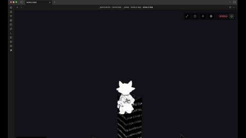
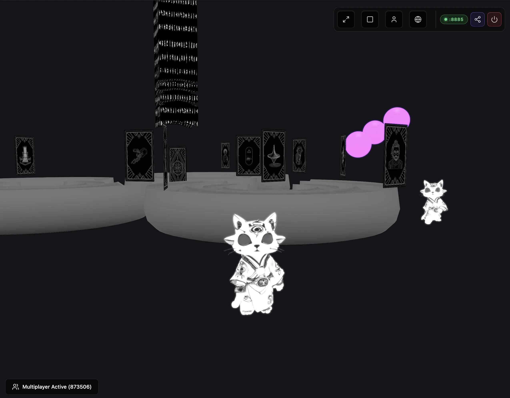

  
  
  <h1 align="center">WORLD 888</h1>
  <h3 align="center"> Physics Sandbox and Multiplayer World </h3>

  <!-- TOP PURPLE LINKS -->
  
  
  
   
  <!-- BOTTOM GOLD TAXONOMY -->
  
  
  
  

  
<i>WORLD 888 is a persistent, physics-enabled 3D simulation sandbox built as a native Datacore component, utilizing Babylon.js and the Havok physics engine to provide first-person mechanics, dual-transport multiplayer synchronization, and in-world object control across both Obsidian and modern web browsers.</i>

## Introduction

WORLD 888 brings advanced 3D visualization and real-time physical simulation to Obsidian notes and web browsers. Powered by the Havok physics engine, the component allows you to explore custom-built 3D layouts, spawn interactive assets, and run local multiplayer sandbox instances synchronized natively across side-by-side Obsidian pane leafs and standalone web tabs.

## Features

### Standalone Web Component & Server
- **Cross-Platform Play**: Run the environment as a native Obsidian component or as a standalone web application (http://localhost:8885).
- **Node.js Sync Server**: Built-in standalone server (world888-server.js) that serves static assets, provides a web entry point, and handles cross-device player synchronization.

### Multiplayer Synchronizer
- **Dual-Transport Sync**: Uses BroadcastChannel for zero-latency sync between Obsidian tabs, and SSE + HTTP POST (EventSource) for cross-device sync via the local Node server.
- **Dynamic Player Ghosts**: Remote players are represented using animated cat.glb models with unique, dynamically generated HSL color tints based on their connection IDs.
- **State Animations**: Fully animates ghost players for walking, running, crouching, and sliding based on broadcasted player states.

### Runtime and Agentic Safety
- **Dynamic Watchdog Daemon**: Integrates a file-based command watcher loop that monitors mcp_commands.json for hot reloading.
- **Multidirectional Pane Modes**: Supports standard embedded, fullscreen browser, window overlay, and picture-in-picture floating panels.
- **Resource Lifecycle Guard**: Completely disposes of Babylon.js graphics contexts and Havok physics simulations on unmount to prevent system lag.

### Security and Integrations
- **Sanitized Execution**: Offline-capable layout storage and local BroadcastChannel communication APIs.
- **Aggressive Input Blocking**: Overrides Obsidian commands and default keyboard listeners when focused to redirect inputs entirely to character locomotion and interaction.
- **CDN Loading Cache**: Resolves engine dependencies dynamically via local caching to reduce load times.

### User Interface and Developer Loop
- **Physics-Based character locomotion**: Sprinting, crouching, jumping, and slope-dependent sliding mechanics.
- **Sphere Pip Spawner**: Spawns interactive spheres in-scene that can be clicked to spawn floating secondary window views.

## Directory Index & Components

The package exposes the following files:

| File | Description |
| :--- | :--- |
| **[WORLD 888.md](WORLD%20888.md)** | The main Obsidian leaf entry point loader query. |
| **[src/index.jsx](src/index.jsx)** | Entry bootstrapper hook that handles namespace imports and hot reloading. |
| **[src/App.jsx](src/App.jsx)** | Main coordinator component coordinating states, canvas, and event blocking. |
| **[src/WorldLogic.js](src/WorldLogic.js)** | Scene initializer, script loading orchestrator, and rendering pipeline. |
| **[src/HavokPhysics.js](src/HavokPhysics.js)** | WASM Havok interface and physics aggregate factory helpers. |
| **[src/SceneLoader.js](src/SceneLoader.js)** | Import mesh asynchronous wrapper with local cache integration. |
| **[src/CharacterConstants.js](src/CharacterConstants.js)** | Movement speed, sliding dampening, crouching height, and friction constants. |
| **[src/CharacterLogic.js](src/CharacterLogic.js)** | Lokomotion state machine, camera alignment, and jump/slide triggers. |
| **[src/CharacterVelocity.js](src/CharacterVelocity.js)** | Directional speed multipliers and slide physics calculations. |
| **[src/CameraLogic.js](src/CameraLogic.js)** | First-person camera positioning, offset tracking, and bounds clamping. |
| **[src/SpherePipSpawner.jsx](src/SpherePipSpawner.jsx)** | Mesh click event handler to spawn floating picture-in-picture views. |
| **[src/PaneLogic.js](src/PaneLogic.js)** | Auxiliary pane controls and parent element dimension trackers. |
| **[src/ScreenModeHelper.jsx](src/ScreenModeHelper.jsx)** | Browser fullscreen, Window, and floating PiP modal controller. |
| **[src/LoadScript.js](src/LoadScript.js)** | Dynamic CDN script loader with promise caching. |
| **[src/Multiplayer.js](src/Multiplayer.js)** | BroadcastChannel positioning and rotation updates listener. |
| **[src/PreventDefaultInputs.js](src/PreventDefaultInputs.js)** | Hardened Obsidian key event and Command Palette blocker. |
| **[server/world888-server.js](server/world888-server.js)** | Standalone Node.js server for static assets and cross-client SSE/POST synchronization. |
| **[web-src/index.jsx](web-src/index.jsx)** | Web browser entry point that mocks Datacore dependencies. |
| **[METADATA.md](METADATA.md)** | Manifest YAML properties outlining compatibility, runtime parameters, and index categories. |
| **[CONTRIBUTION.md](CONTRIBUTION.md)** | Developer compilation guidelines and coding standards. |
| **[LICENSE.md](LICENSE.md)** | MIT permissive distribution license. |

## Previews

| Preview | Description |
| :--- | :--- |
|  | 3D physics sandbox view rendering local geometry layout. |

## Contributors

- beto.group
